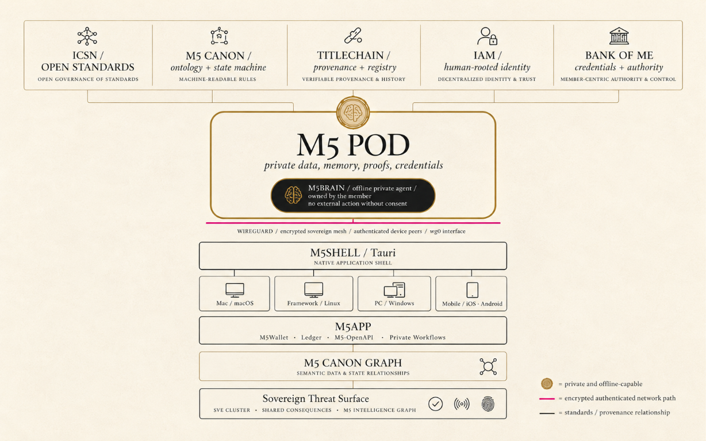

# TitleChain Foundation

**Human authority first. Open infrastructure for the human + AI economy.**

We steward the public ICSN standards and are building pathways for women-led ventures to gain practical skills, identity, agency, technology, networks, and leadership opportunity.

## Help build the public commons

We invite people across technology, law, economics, statistics, finance, identity, privacy, security, accessibility, and community governance to help shape a public commons for the digital-asset edge economy. This includes open review of privacy-preserving, provenance-aware approaches to real-time economic indicators and methodologies.

**[Join the public conversation](https://github.com/orgs/TitleChain-Foundation/discussions/19) · [Track the SEC transfer-agent review](https://github.com/TitleChain-Foundation/icsn-standards/milestone/2) · [Review the featured visuals](https://github.com/TitleChain-Foundation/icsn-standards/tree/main/assets/public-review)**

The visuals are **Illustrative Public Review Drafts**. They are not adopted standards, official statistics, regulated benchmarks, production deployments, credentials, certifications, or representations of government endorsement. Maintained repository text and governance records control where visual shorthand differs.

| Human-authorized wallet and agent controls | Economic and rights layers |
| --- | --- |
|  |  |

## Start here

| I want to | Go here |
| --- | --- |
| Ask, introduce myself, share an idea, or offer a skill | [Use Contributor Q&A](https://github.com/orgs/TitleChain-Foundation/discussions/categories/contributor-q-a) |
| Review the demo or explore an activation program | [Visit Programs & Activation](https://github.com/orgs/TitleChain-Foundation/discussions/categories/programs-activation) |
| Review the SEC filing's public reference artifacts | [Open the Appendix B artifact directory](https://github.com/orgs/TitleChain-Foundation/discussions/19) |
| Track all seven SEC transfer-agent review topics | [Open the SEC public-review milestone](https://github.com/TitleChain-Foundation/icsn-standards/milestone/2) |
| Join the M5POD activation waitlist | [Reserve your M5POD](https://m5podactivationdemo.netlify.app/waitlist.html) |
| Review standards or claim scoped work | [Explore ICSN Standards](https://github.com/TitleChain-Foundation/icsn-standards) |
| Fund public work and contributor capacity | [Sponsor the Foundation](https://github.com/sponsors/TitleChain-Foundation) |
| Discuss an organizational partnership | [Contact the Foundation](mailto:hello@titlechainfoundation.org) |

**One public pathway:** Discussion -> scoped Issue -> contribution -> independent review -> evidence -> release.

## Skills we need

We welcome focused help from engineers, architects, security and privacy reviewers, identity and authorization specialists, legal and governance reviewers, researchers, educators, accessibility testers, technical writers, and community builders.

[Choose a contribution by skill](https://github.com/TitleChain-Foundation/icsn-standards/blob/main/CONTRIBUTOR-PATHWAYS.md). You can review one flow, test one claim, improve one document, or recommend one concrete change.

The organization currently has three GitHub members. Public participation does not require organization membership, IAM, an M5 account, or a funded role. We are building a public contribution record while raising funds for defined work.

## What is public and private

TitleChain Foundation governs the public standards process. **ICSN** contains public RFCs, schemas, governance, and conformance work. **M5** is one implementation and activation environment; it does not own the standard.

Never post credentials, private participant data, wallet information, confidential business material, production secrets, or unreported vulnerabilities in public Discussions or Issues.

Publication, participation, waitlist enrollment, or sponsorship does not create a credential, account, job, investment, governance authority, legal representation, or standards approval. Funding does not purchase standards control or access to private data.

## Public commitments

- Human authority remains the root of consequential digital authority.
- Privacy, meaningful consent, portability, recovery, and the right to exit are structural requirements.
- Standards remain open to public review and independent implementation.
- The goal to support up to [100,000 women-led ventures](https://github.com/TitleChain-Foundation/icsn-standards/blob/main/initiatives/100K-WOMEN-LED-VENTURES.md) is an activation goal, not a claim of completed enrollment or funding.

[Governance](https://github.com/TitleChain-Foundation/icsn-standards/blob/main/GOVERNANCE.md) | [Security](https://github.com/TitleChain-Foundation/icsn-standards/blob/main/SECURITY.md) | [Code of Conduct](https://github.com/TitleChain-Foundation/icsn-standards/blob/main/CODE_OF_CONDUCT.md) | [Trust and Non-Capture](https://github.com/TitleChain-Foundation/icsn-standards/blob/main/TRUST-AND-NON-CAPTURE.md)

**Follow. Review. Build. Sponsor. Bring one more capable person into the work.**

## Press and media

**September 3, 2026:** [TitleChain Foundation Opens Sovereign AI & Digital Asset Commons, Invites Builders](https://www.prlog.org/13168578-titlechain-foundation-opens-sovereign-ai-digital-asset-commons-invites-builders.html)

For current Foundation information, visit [TitleChainFoundation.org](https://titlechainfoundation.org/). For M5 product, technology, architecture, research, and public media, visit [M5Bank.app](https://m5bank.app/). Media and partnership inquiries may be directed to [hello@titlechainfoundation.org](mailto:hello@titlechainfoundation.org).
