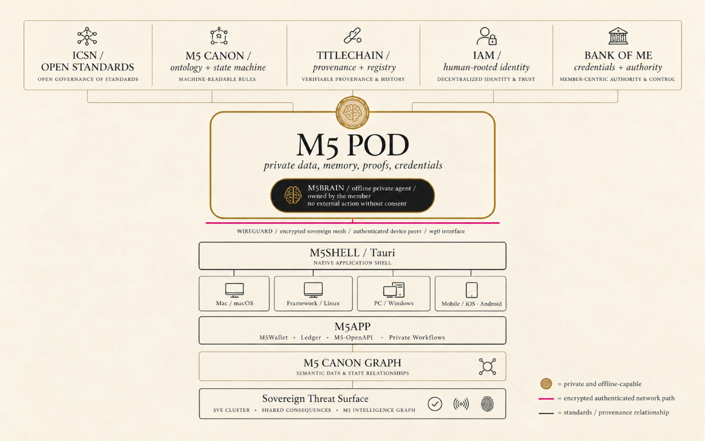
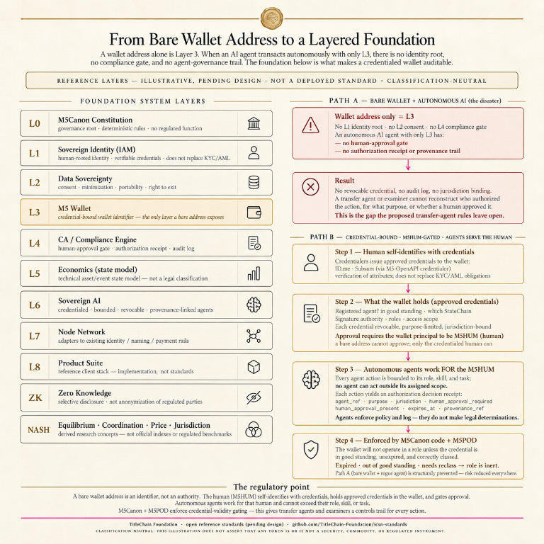
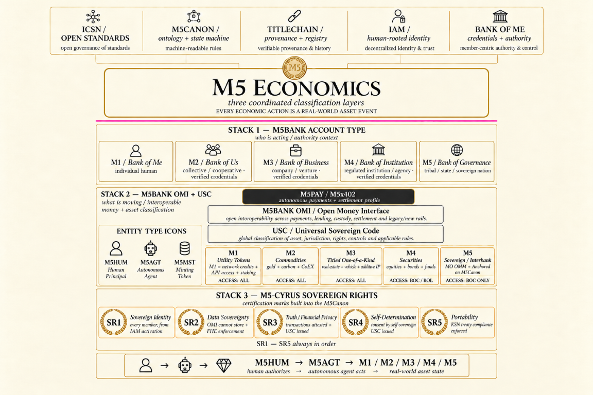

<a href="https://titlechainfoundation.org">
  <picture>
    <source media="(prefers-color-scheme: dark)" srcset="https://raw.githubusercontent.com/TitleChain-Foundation/.github/main/profile/assets/titlechain-wordmark-dark.png">
    
  </picture>
</a>

**We're [TitleChain Foundation](https://titlechainfoundation.org), a nonprofit that stewards open standards, open-source infrastructure and public research for a human + AI economy where human authority comes first.** We serve people, businesses, communities, and public institutions that need agreements, rights, and digital assets to move with verifiable trust, so that decisions are auditable, agents remain accountable to humans, and no single company controls the trust layer.

[Explore the standards](https://github.com/TitleChain-Foundation/icsn-standards) • [Join the discussion](https://github.com/orgs/TitleChain-Foundation/discussions) • [Follow the SEC review](https://titlechain-foundation.github.io/M5-AI-Sovereign-Commons/sec-observatory/) • [Sponsor our work](https://github.com/sponsors/TitleChain-Foundation) • [More on our website](https://titlechainfoundation.org)

We are building the public commons for a human + AI economy where agreements, rights, and digital assets can move with verifiable trust; decisions are auditable; agents remain accountable to humans; and no single company controls the trust layer.

Open standards. Open source. Open weights. Verifiable rights. Human control.

| Front door | What you'll find |
| --- | --- |
| [**titlechainfoundation.org**](https://titlechainfoundation.org) | The Foundation: mission, M5-CV, press and public calls |
| [**ICSN Standards**](https://github.com/TitleChain-Foundation/icsn-standards) | The specifications: namespaces, classifications, bridge mappings and legislation |
| [**M5 AI Sovereign Commons**](https://github.com/TitleChain-Foundation/M5-AI-Sovereign-Commons) | The standards applied: three real-world projects, SEC review and SHADOW public research. [Glossary](https://github.com/TitleChain-Foundation/M5-AI-Sovereign-Commons/blob/main/GLOSSARY.md) |
| [**m5bank.app**](https://m5bank.app) | The M5 member entry point: whitepapers, including *Pax Economica*, the FAQ and sign-up |
---

## Start here — pick your door

| I am a... | Go here |
| --- | --- |
| **Investor / funder** | [Featured projects](#featured-projects) · [Sponsor the Foundation](https://github.com/sponsors/TitleChain-Foundation) |
| **Policy / legal reviewer** | [Legislative review](#legislative-review) · [SEC Public Input Summary](https://github.com/TitleChain-Foundation/M5-AI-Sovereign-Commons/blob/main/sec-public-input/README.md) |
| **Builder / contributor** | [Skills we need](#skills-we-need) · [Explore ICSN Standards](https://github.com/TitleChain-Foundation/icsn-standards) |
| **Prospective member** | [Set up your free IAM account](https://m5bank.app/) · [Reserve your M5POD](https://m5podactivationdemo.netlify.app/) |
| **Press** | [Press and media](#press-and-media) |

Every task from the original page is still here — see the [full task index](#all-pathways-by-task) at the bottom if you want everything in one table.

---

## Legislative review

### Sovereign Compute Access Act - Draft v1

TitleChain Foundation has published model legislation proposing private and
local access to open-weight AI, human authority over agent actions,
state-primary administration, vendor neutrality, public disclosures, and
anti-capture safeguards.

Status and Public-Interest Work

This proposal is not enacted law, has not been introduced by a legislative office, and is not yet an adopted ICSN standard. It is published for research, education, public review, and further legislative and standards development.

It is part of a broader body of work developed, presented, and advanced since 2017 across legislation, regulatory testimony, open standards, public education, and technical infrastructure for the emerging human + AI and digital-asset economy.

That work includes initiatives and proposals addressing the Bill of AI-Chip Rights, BRIDGE — Blockchain Registry Inter-bank Digital Asset Exchange, Swift-BRIDGE, the Sovereign Compute Access Act, Digital Asset Property Title Rights, 23andMine, and related frameworks for sovereign identity, digital property, compute access, machine authority, financial infrastructure, and human rights in an AI-native economy.

The purpose of publishing this work in the public commons is to make the underlying research, architecture, draft language, testimony, and technical standards available for independent review, improvement, implementation, and consideration by lawmakers, regulators, researchers, technologists, and the public.

These are not claims of enacted law. They are part of an ongoing public body of work designed to help develop the legal and technical infrastructure for the next generation of the digital economy.

**[Read the full legislation](https://github.com/TitleChain-Foundation/icsn-standards/blob/main/legislation/sovereign-compute-access-act/OFFICIAL-TEXT.md) · [View the Act carousel](https://titlechain-foundation.github.io/icsn-standards/sovereign-compute-review/media/carousel/index.html) · [View the Open Weights + M5 carousel](https://titlechain-foundation.github.io/icsn-standards/sovereign-compute-review/media/open-weight-m5/index.html) · [Open the public-review hub](https://github.com/TitleChain-Foundation/icsn-standards/blob/main/legislation/sovereign-compute-access-act/PUBLIC-REVIEW.md) · [Submit a public comment](https://github.com/orgs/TitleChain-Foundation/discussions/38) · [Explore ICSN](https://github.com/TitleChain-Foundation/icsn-standards)**

Comments, legal analysis, technical review, accessibility feedback, proposed
amendments, and legislative-office inquiries are welcome. Nonpublic inquiries
may be sent to
[support@titlechainfoundation.org](mailto:support@titlechainfoundation.org).

CLICK TO View supporting appendix diagrams (Sovereign Intelligence Stack, Open-Weight Compute Reference)

### Sovereign Intelligence Stack

A human-first reference architecture for locally controlled intelligence,
memory, authority, and optional external providers across personal, community,
business, institutional, and government contexts. This is non-normative
Appendix B to the model act.

**[Open the interactive appendix](https://github.com/TitleChain-Foundation/icsn-standards/blob/main/legislation/sovereign-compute-access-act/appendices/SOVEREIGN-INTELLIGENCE-STACK.html) · [Comment on the architecture](https://github.com/orgs/TitleChain-Foundation/discussions/38)**

### Open-Weight Compute Reference

	

A proposed, non-normative reference for discussing personal, pooled, and
frontier compute; open-weight model access; hardware capability; registered
sovereign nodes; and reciprocity for publicly supported training. The
classifications are open questions for legal, technical, economic, security,
accessibility, and implementation review.

**[Open the full reference](https://github.com/TitleChain-Foundation/icsn-standards/blob/main/legislation/sovereign-compute-access-act/appendices/OPEN-WEIGHT-COMPUTE-REFERENCE.html) · [Review the current seed questions](https://github.com/orgs/TitleChain-Foundation/discussions/38) · [Submit evidence or corrections](https://github.com/orgs/TitleChain-Foundation/discussions/38)**

---

## From legislation to implementation

We invite companies, providers, researchers, educators, workforce organizations, and people across technology, law, economics, statistics, finance, identity, privacy, security, accessibility, and community governance to help shape a public commons for the digital-asset edge economy. Participants can propose one bounded product, interface, dataset, methodology, skill, role-transition need, or training pathway across the stack.

**[Set up your IAM account](https://m5bank.app/) · [Reserve your M5POD](https://m5podactivationdemo.netlify.app/) · [Choose a commons contribution track](https://github.com/TitleChain-Foundation/icsn-standards/blob/main/COMMONS-CONTRIBUTION-TRACKS.md) · [Review native M5Agents](https://github.com/orgs/TitleChain-Foundation/discussions/23) · [Introduce a proposal](https://github.com/orgs/TitleChain-Foundation/discussions/22) · [Open the SEC current status summary](https://github.com/TitleChain-Foundation/M5-AI-Sovereign-Commons/blob/main/sec-public-input/README.md)**

> **The M5 architecture makes AI operationally useful without allowing AI, credentials, wallets, employees, contractors, APIs, or third-party systems to become unaccountable sources of authority.**

The visuals are **Illustrative Public Review Drafts**. They are not adopted standards, official statistics, regulated benchmarks, production deployments, credentials, certifications, or representations of government endorsement. Maintained repository text and governance records control where visual shorthand differs.

View architecture diagrams (M5POD stack, wallet controls, economic layers)

**M5POD private member stack**

| Human-authorized wallet and agent controls | Economic and rights layers |
| --- | --- |
|  |  |

---

## Featured projects

Three public development simulations connect the Commons standards to assets,
authority, financing boundaries, and accountable records. These are research
and diligence projects, not offerings, approved transactions, or grants of authority.

### GSA / CRE

#### 312 Spring Commons — California

A public real-estate and historic-reuse simulation centered on 312 N. Spring
Street, Los Angeles. It connects GSA disposition diligence, title and public-owner
authority, capital provenance, rehabilitation, and public-benefit operations.
The updated work includes *The Bear Comes Home* and the **Public Bank of
California concept**, with bank/escrow and securities records kept separate.

**Concept and diligence only:** no property award, bank charter, California-agency
status, deposit-taking, committed financing, or regulated-intermediary status.

[Explore Spring Commons](https://github.com/TitleChain-Foundation/M5-AI-Sovereign-Commons/blob/main/pilots/312-spring-commons/README.md) ·
[Read The Bear Comes Home](https://github.com/TitleChain-Foundation/M5-AI-Sovereign-Commons/blob/main/pilots/312-spring-commons/briefs/PPT-EZ-CA-0001-THE-BEAR-COMES-HOME-PUBLIC-BANK-OF-CALIFORNIA-CONCEPT-v0.1.md) ·
[Review GSA diligence](https://github.com/TitleChain-Foundation/M5-AI-Sovereign-Commons/blob/main/pilots/312-spring-commons/update-notes/GSA-PATHWAY-AND-APPLICATION-READINESS.md) ·
[Initial capital tranche brief](https://github.com/TitleChain-Foundation/M5-AI-Sovereign-Commons/blob/main/pilots/312-spring-commons/documents/summaries/SPRING-INITIAL-CAPITAL-TRANCHE-BRIEF.md)

### FARMLAND / REDEVELOPMENT

#### America's People's Trust Farmland

A repeatable stewardship simulation connecting farmland, food production, local
operators, title and economic-right separation, correction, and portable evidence.
Pilot 001 tests the sample-data process; later pilots are intended to test
independent replication and scale without concentrating ownership or authority.

The **275,000-acre figure is a research-pipeline target**, not acreage owned,
controlled, under contract, or offered by the Foundation or People's Trust.

[Explore the Farmland simulation](https://github.com/TitleChain-Foundation/M5-AI-Sovereign-Commons/blob/main/pilots/peoples-trust/README.md) ·
[Capital & Operating Partner Brief](https://github.com/TitleChain-Foundation/M5-AI-Sovereign-Commons/blob/main/pilots/peoples-trust/CAPITAL-AND-OPERATING-PARTNER-BRIEF.md)

### GLOBAL DEVELOPMENT PROJECT

#### Global UN Commons — UN-NY-0001

*Global UN Commons — concept and design by TitleChain Foundation (2026).*

An international development concept exploring public-record and transfer-agent
interoperability across a proposed 193-Member-State jurisdiction-profile inventory.
The V1–V4 visual library preserves the project's progression and supporting research.

**Independent concept:** no United Nations or Member State endorsement, government
participation, nation-chain activation, or institutional authority is implied.
Each jurisdiction requires its own lawful mandate and accountable operators.

[Explore Global UN Commons](https://github.com/TitleChain-Foundation/M5-AI-Sovereign-Commons/blob/main/pilots/global-un-commons/README.md) ·
[View the V1–V4 visual library](https://github.com/TitleChain-Foundation/M5-AI-Sovereign-Commons/blob/main/pilots/global-un-commons/visuals/README.md) ·
[Founding Institutional Underwriter Brief](https://github.com/TitleChain-Foundation/M5-AI-Sovereign-Commons/blob/main/pilots/global-un-commons/FOUNDING-INSTITUTIONAL-UNDERWRITER-BRIEF.md)

---

## Commons standards and SEC public review

SEC public input is a cross-cutting research and public-review layer across the
three development lanes. Repository reviews and GitHub comments are not SEC
submissions, adopted rules, or SEC endorsement. The Foundation's September 5
filing remains distinct from its September 24 implementation review.

[Explore the M5 AI Sovereign Commons](https://github.com/TitleChain-Foundation/M5-AI-Sovereign-Commons) ·
[SEC Public Input Summary](https://github.com/TitleChain-Foundation/M5-AI-Sovereign-Commons/blob/main/sec-public-input/README.md) ·
[Pilot/SEC Crosswalk v0.2](https://github.com/TitleChain-Foundation/M5-AI-Sovereign-Commons/blob/main/docs/PILOT-SEC-RFI-CROSSWALK.md) ·
[September 24 Open Commons Review](https://github.com/TitleChain-Foundation/M5-AI-Sovereign-Commons/blob/main/sec-public-input/open-commons-review/2026-09-24.md) ·
[Live SEC Public Comment Observatory](https://titlechain-foundation.github.io/M5-AI-Sovereign-Commons/sec-observatory/)

---

## Skills we need

We welcome focused help from engineers, architects, security and privacy reviewers, identity and authorization specialists, legal and governance reviewers, researchers, educators, accessibility testers, technical writers, and community builders.

[Choose a contribution by skill](https://github.com/TitleChain-Foundation/icsn-standards/blob/main/CONTRIBUTOR-PATHWAYS.md). You can review one flow, test one claim, improve one document, or recommend one concrete change.

The organization currently has three GitHub members. Public participation does not require organization membership, IAM, an M5 account, or a funded role. We are building a public contribution record while raising funds for defined work.

**One public pathway:** Discussion -> scoped Issue -> contribution -> independent review -> evidence -> release.

## What is public and private

TitleChain Foundation governs the public standards process. **ICSN** contains public RFCs, schemas, governance, and conformance work. **M5** is one implementation and activation environment; it does not own the standard.

Never post credentials, private participant data, wallet information, confidential business material, production secrets, or unreported vulnerabilities in public Discussions or Issues.

Publication, participation, waitlist enrollment, or sponsorship does not create a credential, account, job, investment, governance authority, legal representation, or standards approval. Funding does not purchase standards control or access to private data.

## Public commitments

- Human authority remains the root of consequential digital authority.
- Privacy, meaningful consent, portability, recovery, and the right to exit are structural requirements.
- Standards remain open to public review and independent implementation.
- The goal to support up to [100,000 women-led ventures](https://github.com/TitleChain-Foundation/icsn-standards/blob/main/initiatives/100K-WOMEN-LED-VENTURES.md) is an activation goal, not a claim of completed enrollment or funding.

[Governance](https://github.com/TitleChain-Foundation/icsn-standards/blob/main/GOVERNANCE.md) | [Security](https://github.com/TitleChain-Foundation/icsn-standards/blob/main/SECURITY.md) | [Code of Conduct](https://github.com/TitleChain-Foundation/icsn-standards/blob/main/CODE_OF_CONDUCT.md) | [Trust and Non-Capture](https://github.com/TitleChain-Foundation/icsn-standards/blob/main/TRUST-AND-NON-CAPTURE.md)

**Follow. Review. Build. Sponsor. Bring one more capable person into the work.**

## Press and media

- [TitleChain Foundation Opens Public Commons Reference Project for Real-World Asset Transfer](https://titlechainfoundation.org/press/public-commons-reference-project)
- [TitleChain Foundation Publishes Model Legislation Guaranteeing Free Public Access to Open-Weight AI](https://titlechainfoundation.org/press/sovereign-compute-access-act)
- [TitleChain Foundation Issues Global Call to Build Public-Commons for Human-Controlled AI](https://titlechainfoundation.org/global-call)
- [TitleChain Foundation Opens Sovereign AI & Digital Asset Commons, Invites Builders](https://titlechainfoundation.org/announcement)

For current Foundation information, visit [TitleChainFoundation.org](https://titlechainfoundation.org/). For M5 product, technology, architecture, research, and public media, visit [M5Bank.app](https://m5bank.app/). Media and partnership inquiries may be directed to [hello@titlechainfoundation.org](mailto:hello@titlechainfoundation.org).

---

## All pathways by task

Full task index

| I want to | Go here |
| Front door | What you'll find |
| --- | --- |
| [**ICSN Standards**](https://github.com/TitleChain-Foundation/icsn-standards) | The specifications: namespaces, classifications, bridge mappings and legislation |
| [**M5 AI Sovereign Commons**](https://github.com/TitleChain-Foundation/M5-AI-Sovereign-Commons) | The standards applied: three real-world projects, SEC review and public research |
| [**titlechainfoundation.org**](https://titlechainfoundation.org) | The Foundation: mission, press and public calls |
| [**m5bank.app**](https://m5bank.app) | The M5 member entry point: whitepapers, FAQ and sign-up |

Open standards. Open source. Open weights. Verifiable rights. Human control. · [Full guide, projects and task index →](https://github.com/TitleChain-Foundation/.github/blob/main/profile/GUIDE.md)
